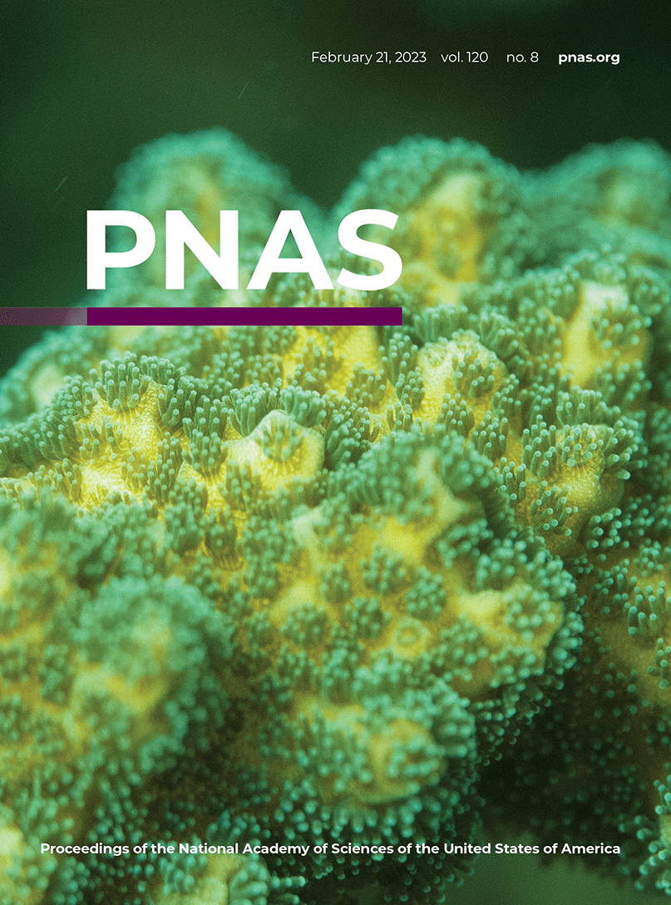
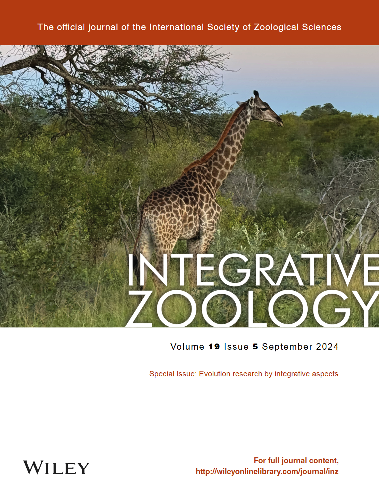
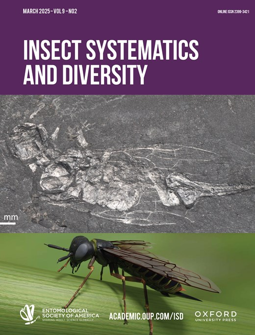
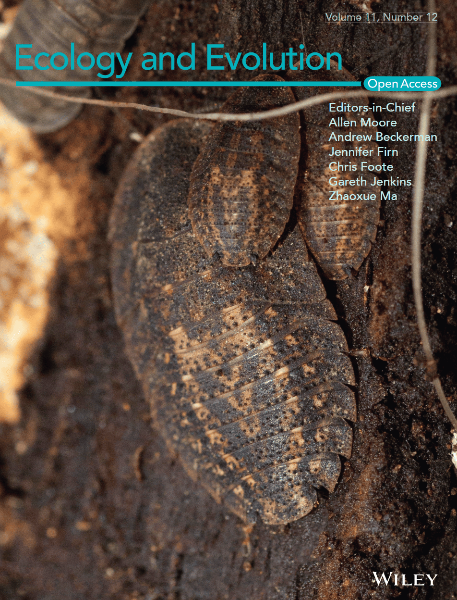
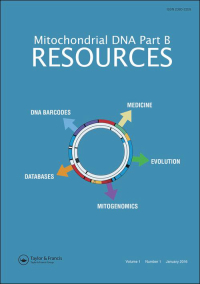

**Notes:** \* Corresponding author, † Co-first

  

    
    
    
    
    
    <!-- Repeated images to create a seamless scroll effect -->
    
    
    
    
    
  

## 2025

Xiao J, **Hao X**, Chiba H, Li Y, Yuan X* (2025). <a href="https://doi.org/10.1002/ece3.71757" target="_blank">Comparative analysis of mitogenomic and nuclear gene data reveals phylogenetic implications, divergence times and historical biogeography in the subfamily Pyrginae (Lepidoptera: Hesperiidae)</a>. _**Ecology and Evolution**_, 15(7), e71757.  
<a href="/files/Xiao_2025_EcE.pdf" target="_blank">PDF</a>  

**Hao X**, Pan Y, Chiba H, Yuan X* (2025). <a href="https://doi.org/10.1093/isd/ixaf002" target="_blank">Phylogeny, divergence times and biogeography of the subfamily Tagiadinae (Lepidoptera: Hesperiidae) based on molecular data and morphological characters</a>. _**Insect Systematics and Diversity**_, 9(2).  

---

## 2024

Wang Z, Tian S, Pang J, Zhang X, **Hao X**, Zhang L, Zhao H* (2024). <a href="https://doi.org/10.1111/1749-4877.12915" target="_blank">Comparative analysis of chromosome‐level genomes provides insights into chromosomal evolution in Chiroptera</a>. _**Integrative Zoology**_.  

**Hao X**, Lu Q, Zhao H* (2024). <a href="https://doi.org/10.1111/1749-4877.12772" target="_blank">A molecular phylogeny for all 21 families within Chiroptera (bats)</a>. _**Integrative Zoology**_, 19(5), 989–998.  

---

## 2023
**Hao X**, Jiao H, Zou D, Li Q, Yuan X, Liao W, Jiang P, Zhao H* (2023). <a href="https://www.pnas.org/doi/full/10.1073/pnas.2218183120" target="_blank">Evolution of bitter receptor genes and ontogenetic dietary shift in a frog</a>. _**Proceedings of the National Academy of Sciences of the United States of America**_, 120(8), e2218183120.  
<a href="/files/Hao_2023_PNAS.pdf" target="_blank">PDF</a> | <a href="/files/Hao_2023_PNAS_sapp.pdf" target="_blank">Supplementary Methods</a> | <a href="/files/Hao_2023_PNAS_commentary.pdf" target="_blank">PNAS Commentary</a> | <a href="https://www.pnas.org/doi/10.1073/iti0823120" target="_blank">Highlighted in this issue</a>

---

## 2022
Xiao J, Liu J, Ma L, **Hao X**, Yu R, Yuan X* (2022). <a href="https://doi.org/10.3390/insects13010068" target="_blank">Mitogenomes of nine Asian skipper genera and their phylogenetic position (Lepidoptera: Hesperiidae: Pyrginae)</a>. _**Insects**_, 13(1), 68.  
<a href="/files/Xiao_2022_Insects.pdf" target="_blank">PDF</a>  

---

## 2021
**Hao X**, Liu J, Chiba H, Xiao J, Yuan X* (2021). <a href="https://doi.org/10.1002/ece3.7666" target="_blank">Complete mitochondrial genomes of three skippers in the tribe Aeromachini (Lepidoptera: Hesperiidae: Hesperiinae) and their phylogenetic implications</a>. _**Ecology and Evolution**_, 11(12), 8381–8393.  
<a href="/files/Hao_2021_EcE.pdf" target="_blank">PDF</a>  

**Hao X**, Zhao J, Hao R, Zhao Y, Yuan X* (2021). <a href="https://www.tandfonline.com/doi/full/10.1080/23802359.2021.1914523" target="_blank">Complete mitochondrial genome of the Small-Branded Swift: _Pelopidas mathias_ (Lepidoptera, Hesperiidae)</a>. _**Mitochondrial DNA Part B: Resources**_, 6(5), 1599-1600.  
<a href="/files/Hao_2021_Mitochondrial_DNA.pdf" target="_blank">PDF</a>  

Xu R†, Duan L†, **Hao X†**, Xiao J, Yuan X* (2021). <a href="https://doi.org/10.1080/23802359.2021.1927875" target="_blank">Characterization of complete mitochondrial genome of Polyura narcaeus (Lepidoptera: Nymphalidae: Charaxinae)</a>. _**Mitochondrial DNA Part B: Resources**_, 6(5), 1654-1655.  
<a href="/files/Xu_2021_Mitochondrial_DNA.pdf" target="_blank">PDF</a>  

Sun Q†, Yang Y†, **Hao X**, Xiao J, Liu J, Yuan X* (2021). <a href="https://doi.org/10.3390/insects12080757" target="_blank">Comparative mitogenomic analysis of five awl skippers (Lepidoptera: Hesperiidae: Coeliadinae) and their phylogenetic implications</a>. _**Insects**_, 12(8), 757.  
<a href="/files/Sun_2021_Insects.pdf" target="_blank">PDF</a>  

---

## 2019
**Hao X**\* (2019). <a href="https://www.tandfonline.com/doi/full/10.1080/23802359.2019.1681316" target="_blank">Complete mitochondrial genome of the East Asian fish-eating bat: _Myotis ricketti_ (Chiroptera, Vespertilionidae)</a>. _**Mitochondrial DNA Part B: Resources**_, 4(2), 3748–3749.  
<a href="/files/Hao_2019_Mitochondrial_DNA.pdf" target="_blank">PDF</a>  

